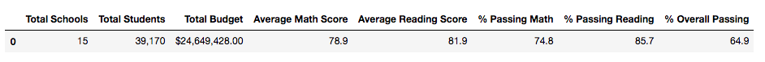
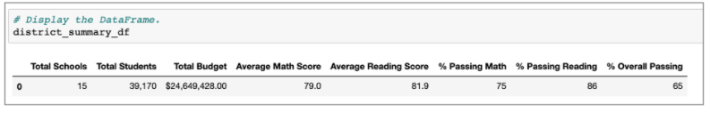
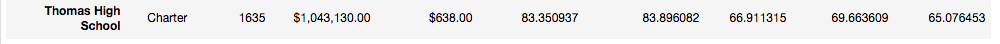
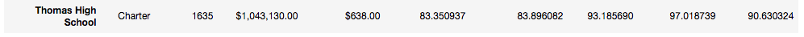
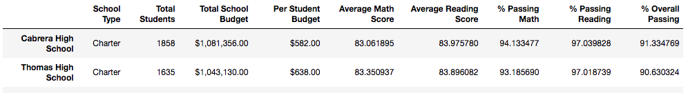

# School_District_Analysis
Using Python

## Overview
The purpose of this analysis was to provide the Maria and the school board with an updated analysis since the students_complete.csv file showed evidence of academic dishonesty that a few reading and math grades had been altered. Maria and her supervisor asked that I replace the math and reading scores for Thomas High School ninth graders that have been altered with NaNs while keeping the rest of the data intact. 

## Results
- How is the district summary affected?
The district summary shows the least amount of change from replacing the Thomas High School ninth grade math and reading scores to NaNs, as it is the most high-level analysis conducted. The only minor change is the average math score, which is now 78.9, a 0.1 difference from the original analysis.

- How is the school summary affected?

Only one row, the Thomas High School's associated data, is affected in the school summary. Here, Thomas High School's average math and reading scores, the % passing math, reading, and overall are all updated to reflect the values without taking the ninth graders into account. 

- How does replacing the ninth graders’ math and reading scores affect Thomas High School’s performance relative to the other schools?

Replacing the ninth graders' math and reading scores dramatically bumped up the passing percentages for math and reading, as well as overall. Prior to replacing the scores, Thomas High School's performance for math, reading, and overall were all around the 60% range. After removing them from the updated analysis, the school's performance shot up to the 90% range for all three percentages. Relative to the other schools, Thomas High School is now top 2 based off of the % Overall Passing metric, when before they would not have been ranked in the top 5. 

- How does replacing the ninth-grade scores affect the following:
  - Math and reading scores by grade
         - Specifically for 9th graders at Thomas High School, NaNs are now reflected for 9th graders for the math and reading averages.
  - Scores by school spending
        - Since this is a collective analysis of all the schools by spending and many of the numbers are rounded to the nearest whole number, the $630-$644 bin that Thomas High            School is included in does not show any noticeable difference in the averages or passing percentages. 
  - Scores by school size
        - Since this is a collective analysis of all the schools by school size and many of the numbers are rounded to the nearest whole number, the medium bin that Thomas High            School is included in does not show any noticeable difference in the averages or passing percentages. 
  - Scores by school type
        - Since this is a collective analysis of all the schools by school type and many of the results are rounded to the nearest whole number, the charter school type that               Thomas High School is included in does not show any noticeable difference in the averages or passing percentages. 

## Summary
Summarize four major changes in the updated school district analysis after reading and math scores for the ninth grade at Thomas High School have been replaced with NaNs.
- After replacing the ninth grade Thomas High School values in the updated analysis, the school's performance shot up to the 90% range for all three % passing percentages for math, reading, and overall.
- Before replacing the ninth grader's performances, Thomas High School's overall passing percentage, 65.08% ranked them at 8th overall. After replacing the values, the overall passing percentage of 90.63% ranked them as 2nd overall.
- In the district summary, the average math score went down to 78.9 from 79 when replacing the ninth grade Thomas High School values with NaNs.
- For the average math and reading scores for Thomas High School, the average math score stayed relatively the same at 83%. However, the average reading score jumped up from 83.90 to 93.19 by 10%. 
